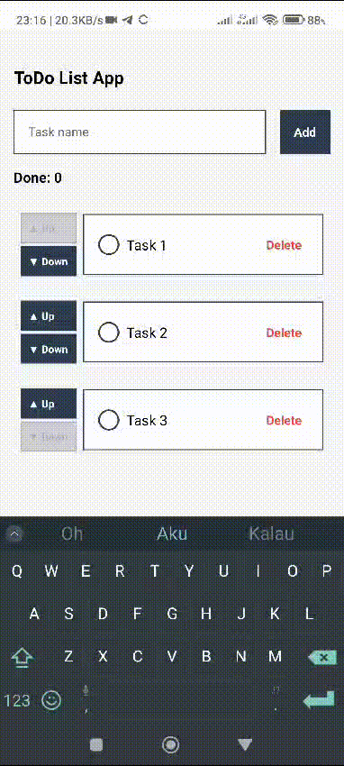

# Todo List App 



## ⚙️ Feature

- Adding new todo items. ✅
- Deleting todo items. ✅
- Counter showing total of completed todos. ✅
- Changing the position of todo items (up/down). ✅
- Using Typescript. ✅
- Using Context API. ✅
- Adding validation add empty text. ✅
- Added validation to disable the `move up` button for the first item.✅
- Added validation to disable the `move down` button for the last item.✅

<hr>

This is an [Expo](https://expo.dev) project created with [`create-expo-app`](https://www.npmjs.com/package/create-expo-app).

## Get started

1. Install dependencies

   ```bash
   npm install
   ```

2. Start the app

   ```bash
    npx expo start
   ```

In the output, you'll find options to open the app in a

- [development build](https://docs.expo.dev/develop/development-builds/introduction/)
- [Android emulator](https://docs.expo.dev/workflow/android-studio-emulator/)
- [iOS simulator](https://docs.expo.dev/workflow/ios-simulator/)
- [Expo Go](https://expo.dev/go), a limited sandbox for trying out app development with Expo

You can start developing by editing the files inside the **app** directory. This project uses [file-based routing](https://docs.expo.dev/router/introduction).


## Join the community

Join our community of developers creating universal apps.

- [Expo on GitHub](https://github.com/expo/expo): View our open source platform and contribute.
- [Discord community](https://chat.expo.dev): Chat with Expo users and ask questions.
